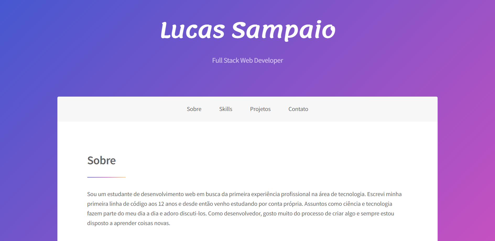

<h1 align="center">
     <a href="http://lucasgbsampaio.github.io/portfolio" alt="Lucas Sampaio">Lucas Sampaio</a>
</h1>

Este repositório se trata do meu portfólio, hospedado no github pages e totalmente responsivo.

---

## Demonstração da aplicação

<p align="center" style="display: flex; align-items: flex-start; justify-content: center;">
  
</p>

---

### Pré-requisitos

Antes de começar, você vai precisar ter instalado em sua máquina as seguintes ferramentas:
[Git](https://git-scm.com), [Node.js](https://nodejs.org/en/) e [Yarn](https://yarnpkg.com/).

---

### Rodando a aplicação

```
# Clone este repositório
$ git clone https://github.com/lucasgbsampaio/portfolio.git

# Acesse a pasta do projeto no terminal/cmd para ter acesso a raiz da pasta
$ cd portfolio

# Instale as dependências
$ yarn

# Execute a aplicação
$ yarn start

# A aplicação será aberta na porta:3000 - acesse http://localhost:3000
```

---

## Tecnologias

- **[React](https://reactjs.org/)**
- **[React-Icons](https://react-icons.github.io/react-icons/)**

---

## Status

Concluído ✔️✔️✔️

---

## 👨‍💻 Autor

- **Lucas Sampaio (lucasgbsampaio)** - [Twitter](https://twitter.com/lucasgbsampaio) - [LinkedIn](https://www.linkedin.com/in/lucasgbsampaio/)

---

## 📝 Licença

Este projeto está sob a licença [MIT](./LICENSE).
